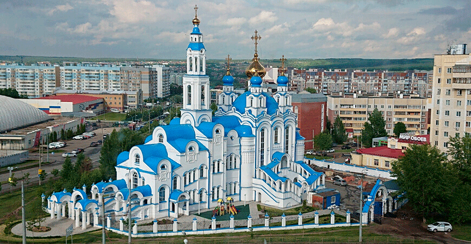

<h2 align="center">Hi there, I'm Alexsander<align="center"> from Kazan Russia</h2>

<a href="https://alexgeorgchist.github.io">http://alexgeorgchist.github.io</a> - the address of the church website.

The temple is located in the Soviet district of the city of Kazan, on the territory of a large residential area of ​​Azino, at the intersection of Academician Sakharov and Rashid Vagapov streets.<//p>
